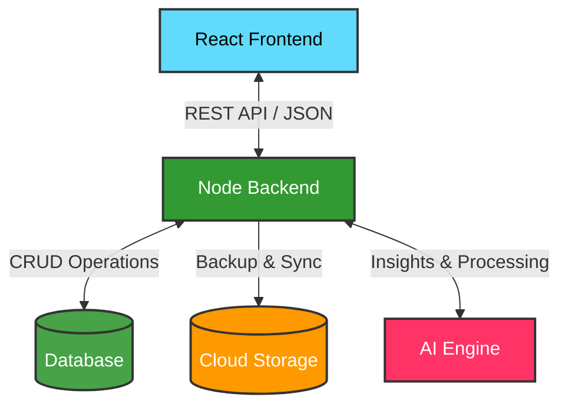

<div align="center">

# 🎓 Smart Attendance Management System

**A modern, cloud-ready SaaS platform tailored for educational institutions to track, manage, and analyze student attendance seamlessly.**

[](https://github.com/Bhishamt/Smart-Attendance-System)
[](https://opensource.org/licenses/MIT)
[](https://reactjs.org/)
[](https://www.typescriptlang.org/)
[](https://nodejs.org/)
[](https://vitejs.dev/)
[](#)

</div>

<br />

## 📖 Project Overview

**Smart Attendance System** is a professional, mobile-first platform designed to digitize and automate the traditional attendance-taking process. 

### 🛑 Problem Statement
Traditional paper-based attendance systems are time-consuming, prone to human error, and lack real-time visibility. Teachers spend valuable instructional time taking roll calls, while administrators s[...]

### 💡 Why This Project Was Built
This project was built to showcase how modern web technologies (like React, TypeScript, and Node.js) combined with AI engines can solve real-world operational bottlenecks in education. It serves as a [...]

### 🎯 Main Objectives
- **Speed & Efficiency**: Reduce the time spent marking attendance to seconds.
- **Accuracy**: Provide robust and immutable attendance records.
- **Actionable Insights**: Deliver real-time analytics to help educators intervene when students are at risk.
- **Cloud Resilience**: Ensure data is safely backed up and synchronized automatically.

---

## ✨ Features Section

The system offers tailored experiences based on user roles, ensuring everyone has the tools they need.

### 👑 Admin Features
| Feature | Description |
| :--- | :--- |
| **Dashboard** | Centralized view of overall institute metrics and daily attendance rates. |
| **Student Management** | Seamlessly add, edit, organize, and disable student profiles in bulk. |
| **Attendance Management** | Audit attendance records and override data if necessary. |
| **Analytics** | View department-wise averages, consistency metrics, and absentee trends. |
| **Cloud Backup** | Securely synchronize and backup records to external Cloud Workspaces. |

### 👨‍🏫 Teacher Features
| Feature | Description |
| :--- | :--- |
| **Mark Attendance** | Rapid UI for marking students Present, Absent, or Late. |
| **Face Recognition** | Smart capabilities to detect and log attendance automatically (beta). |
| **Student Tracking** | Monitor individual class performance and attendance consistency. |
| **Reports** | Generate quick daily/weekly exports of attendance in PDF/Excel formats. |

### 🎓 Student Features
| Feature | Description |
| :--- | :--- |
| **Attendance History** | Transparent calendar view of past attendance records. |
| **Profile** | Manage personal details and view overall semester statistics. |
| **Analytics** | Visual charts showing personal attendance percentage over time. |
| **Notifications** | Automated alerts when falling below the required attendance threshold. |

---

## 📸 Screenshots Gallery

<div align="center">

| **Dashboard** | **Student List** |
|:---:|:---:|
|  |  |  | 

---

## 🏗️ Architecture

The system is built on a scalable architecture separating the client-side presentation from the robust backend API and services.



---

## 🚀 Getting Started

### Prerequisites
- [Node.js](https://nodejs.org/) (v16+)
- Git

### Installation

1. **Clone the repository:**
   ```bash
   git clone https://github.com/Bhishamt/Smart-Attendance-System.git
   cd Smart-Attendance-System
   ```

2. **Frontend Setup:**
   ```bash
   cd frontend
   npm install
   npm run dev
   ```

3. **Backend Setup:**
   ```bash
   cd ../backend
   npm install
   npm run dev
   ```

---

## 📞 Contact

**Main Account:** [Bhishamt](https://github.com/Bhishamt)  
**Secondary Account:** [Chandrachant (KING000T)](https://github.com/KING000T)

---

<div align="center">
  <b>Built with ❤️ by Bhisham Thakur</b>
</div>
