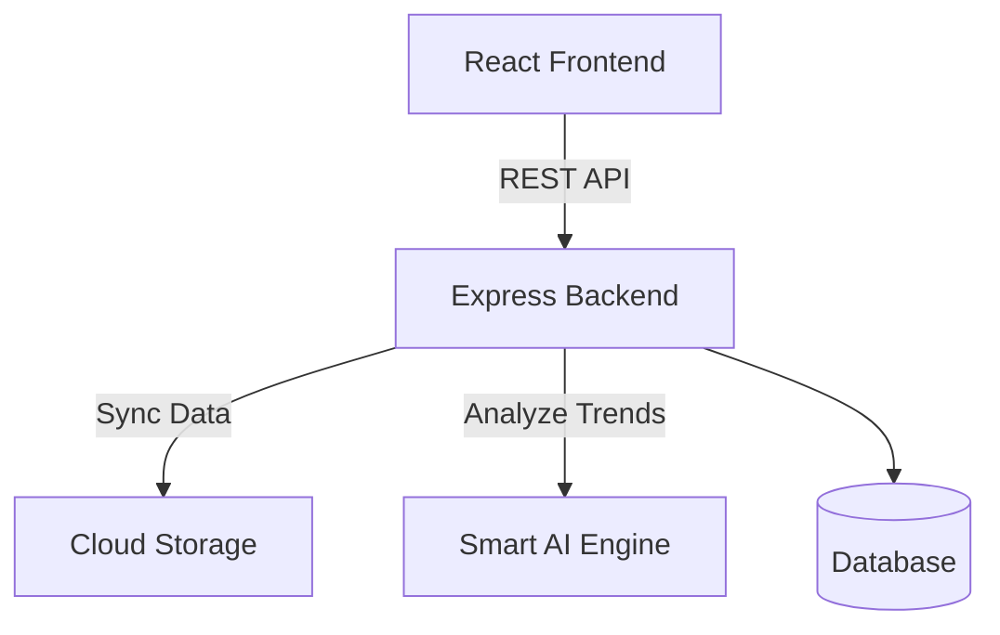

# Smart Attendance Management System


## Project Description
A professional, modern, and cloud-ready SaaS platform tailored for educational institutions to track, manage, and analyze student attendance seamlessly. Featuring real-time dashboard analytics, robust role-based access, automated cloud synchronization, and smart attendance insights driven by an integrated AI engine.

## Features
- **Authentication**: Role-based access control for Admins, Teachers, and Students.
- **Student Management**: Seamlessly add, view, edit, and organize student profiles across classes and departments.
- **Attendance Tracking**: Rapidly mark attendance through a clean, responsive interface designed for speed.
- **Analytics Dashboard**: Real-time insights, multi-department attendance averages, and visual consistency metrics.
- **Reports**: Generate, export (PDF/Excel), and auto-sync attendance reports directly to Cloud Storage.
- **Cloud Sync**: Securely backup and synchronize attendance records to a connected Cloud Workspace.
- **Notifications**: Automated alerts for at-risk students and system activities.
- **Premium UI**: Stunning dark-mode native interface featuring smooth Framer Motion animations and sleek glassmorphism design.

## Screenshots Gallery

<div align="center">
  <h3>Auth & Onboarding</h3>
  
  
</div>

<div align="center">
  <h3>Core Dashboard & Management</h3>
  
  
  
</div>

<div align="center">
  <h3>Attendance Tracking</h3>
  
  
  
</div>

<div align="center">
  <h3>Analytics & Configuration</h3>
  
  
  
</div>

## Tech Stack

**Frontend**:
- React 19 (Web)
- Vite
- TypeScript
- Tailwind CSS & Framer Motion

**Backend**:
- Node.js
- Express
- TypeScript

**Database**:
- In-Memory Data Store (Easily swappable with MongoDB / PostgreSQL)
- Cloud Storage Sync via API

## Architecture Diagram



## Project Structure

```
Smart-Attendance-System/
├── frontend/               # React Client Application
│   ├── src/                # React Source Code
│   │   ├── components/     # Reusable UI components
│   │   ├── screens/        # Full-page application views
│   │   ├── services/       # API integration functions
│   │   ├── App.tsx         # Main application routing & state
│   │   └── index.css       # Tailwind entry and global styles
│   ├── index.html          # HTML entry point
│   ├── package.json        # Frontend dependencies
│   └── vite.config.ts      # Vite configuration
│
├── backend/                # Express Server Application
│   ├── server.ts           # Main Express server and API routes
│   ├── types.ts            # Shared TypeScript types
│   └── package.json        # Backend dependencies
│
├── docs/                   # Documentation and Guides
├── assets/                 # Static Assets and Screenshots
├── README.md               # Main project documentation
├── LICENSE                 # MIT License
├── CONTRIBUTING.md         # Contribution guidelines
└── CHANGELOG.md            # Release history
```

## Installation

Ensure you have [Node.js](https://nodejs.org/) installed on your machine.

1. **Clone the repository:**
   ```bash
   git clone https://github.com/yourusername/Smart-Attendance-System.git
   cd Smart-Attendance-System
   ```

2. **Install Frontend Dependencies:**
   ```bash
   cd frontend
   npm install
   ```

3. **Install Backend Dependencies:**
   ```bash
   cd ../backend
   npm install
   ```

## Running Frontend

To start the Vite development server for the React UI:
```bash
cd frontend
npm run dev
```

## Running Backend

To start the Express server (handling API requests and cloud integrations):
```bash
cd backend
npm run dev
```

## Future Features
- Biometric & Face Recognition Integration
- Push Notifications for Guardians
- Offline Mode Support
- Native Mobile Applications (iOS / Android)
- Enterprise Single Sign-On (SSO) Integration

## Author

**Bhisham Thakur**  
*Computer Engineering Student*

## License

This project is licensed under the [MIT License](LICENSE).
