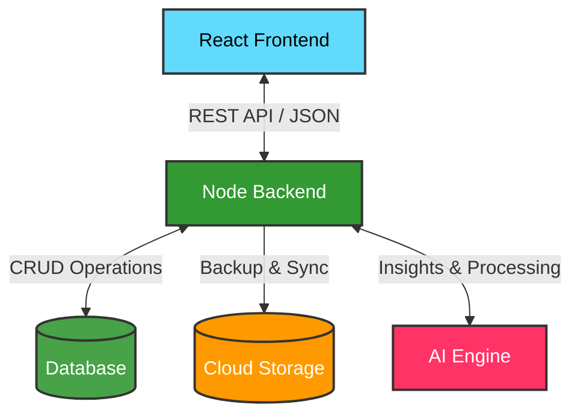

<div align="center">

# Smart Attendance Management System

**A modern, cloud-ready SaaS platform tailored for educational institutions to track, manage, and analyze student attendance seamlessly.**

[](https://github.com/Bhishamt/Smart-Attendance-System)
[](https://opensource.org/licenses/MIT)
[](https://reactjs.org/)
[](https://www.typescriptlang.org/)
[](https://nodejs.org/)
[](https://vitejs.dev/)

</div>

A full-stack web application for educational institutions to manage student attendance with AI-powered insights, cloud backup, and role-based access.

## Features

| Feature | Description |
|---------|-------------|
| **Attendance Tracking** | Mark Present/Absent/Late with toggle UI, batch ops, date selection |
| **Student Management** | Add, edit, approve, and view student profiles with attendance stats |
| **Dashboard & Analytics** | Visual dashboards with charts (area, bar, pie), heatmaps, trends |
| **AI-Powered Insights** | Google Gemini integration for attendance analysis and recommendations |
| **Cloud Backup** | Google Drive OAuth integration for backup/restore |
| **AI Face Recognition** | Simulated biometric scanning for automated roll call |
| **Role-Based Access** | Super Admin, HOD, Teacher, and Student roles |
| **Staff Management** | HOD and Teacher account management |

## Tech Stack

| Layer | Technology |
|-------|-----------|
| Frontend | React 19, TypeScript 5.8, Vite 6, Tailwind CSS 4, Recharts 3 |
| Backend | Node.js, Express 4, TypeScript |
| AI | Google Gemini AI |
| Cloud | Google Drive API (OAuth 2.0) |
| Charts | Recharts 3 |
| Animation | motion, canvas-confetti |
| Icons | lucide-react |

## Project Overview

**Smart Attendance System** is a professional, mobile-first platform designed to digitize and automate the traditional attendance-taking process.

### Problem Statement
Traditional paper-based attendance systems are time-consuming, prone to human error, and lack real-time visibility. Teachers spend valuable instructional time taking roll calls, while administrators struggle to identify chronic absenteeism or generate comprehensive compliance reports quickly.

### Why This Project Was Built
This project was built to showcase how modern web technologies (like React, TypeScript, and Node.js) combined with AI engines can solve real-world operational bottlenecks in education. It serves as a comprehensive portfolio piece demonstrating full-stack architecture, clean UI/UX design, and scalable data management.

### Main Objectives
- **Speed & Efficiency**: Reduce the time spent marking attendance to seconds.
- **Accuracy**: Provide robust and immutable attendance records.
- **Actionable Insights**: Deliver real-time analytics to help educators intervene when students are at risk.
- **Cloud Resilience**: Ensure data is safely backed up and synchronized automatically.

---

## Screenshots Gallery

<div align="center">

| **Dashboard** | **Student List** |
|:---:|:---:|
|  |  |
| *Real-time metrics and overall attendance snapshot* | *Manage students across different classes and semesters* |

| **Attendance** | **Face Recognition & Onboarding** |
|:---:|:---:|
|  |  |
| *Rapid UI for marking student presence* | *Intelligent onboarding and authentication flows* |

| **Student Profile** | **Analytics** |
|:---:|:---:|
|  |  |
| *Detailed individual attendance history and stats* | *Deep insights, consistency metrics, and trends* |

</div>

---

## Architecture

The system is built on a scalable architecture separating the client-side presentation from the robust backend API and services.



## Getting Started

### Prerequisites

- Node.js 18+
- npm

### Installation

```bash
# Install backend dependencies
cd backend
npm install

# Install frontend dependencies
cd ../frontend
npm install

# Return to root
cd ..
```

### Environment Setup

Copy `.env.example` to `.env` and configure:

```env
AI_API_KEY=your_gemini_api_key
APP_URL=http://localhost:5173
GOOGLE_CLIENT_ID=your_oauth_client_id
GOOGLE_CLIENT_SECRET=your_oauth_client_secret
GOOGLE_REDIRECT_URI=http://localhost:3000/api/auth/drive/callback
```

### Running the App

```bash
cd backend
npm run dev
```

Starts both the Express API server (port 3000) and Vite dev server (port 5173).

## Project Structure

```
├── frontend/          # React client application
│   ├── src/
│   │   ├── components/  # Reusable UI components
│   │   ├── screens/     # Full-page views
│   │   ├── App.tsx      # Main app routing & state
│   │   ├── types.ts     # TypeScript definitions
│   │   └── index.css    # Tailwind & global styles
│   ├── index.html
│   └── vite.config.ts
├── backend/           # Express server
│   ├── server.ts      # API routes & integrations
│   └── package.json
├── docs/              # Documentation
├── assets/            # Screenshots & assets
└── README.md
```

## API Overview

| Endpoint | Method | Description |
|----------|--------|-------------|
| `/api/students` | GET/POST | List/add students |
| `/api/students/:id` | GET/PUT | Get/update student |
| `/api/attendance` | GET/POST | Get/mark attendance |
| `/api/staff` | GET/POST | List/add staff |
| `/api/staff/:id` | PUT/DELETE | Update/remove staff |
| `/api/dashboard` | GET | Dashboard stats |
| `/api/ai/analyze` | POST | AI attendance analysis |
| `/api/auth/drive` | GET | Google Drive OAuth |
| `/api/sync/drive` | POST | Backup to Drive |

## License

MIT — see [LICENSE](LICENSE)

## Contact

**Main Account:** [Bhishamt](https://github.com/Bhishamt)
**Secondary Account:** [KING000T](https://github.com/KING000T)

---

<div align="center">
  <b>Built with ❤️ by Bhisham Thakur</b>
</div>
